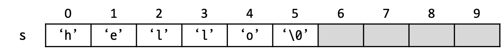

# 문자열

(미완성)

C에서 문자 한 글자를 저장할 때는 `char` 자료형을 쓴다는 것을 배웠다. 문자는 작은따옴표 사이에 넣어 표현한다.

```c++
char a = 'A';
```

하지만 `char`는 정확히 한 글자만 저장할 수 있기 때문에, "hello" 같은 문자열을 `char`형 변수에 저장할 수는 없다.

```c++
char a = 'hello';  // 에러! 작은따옴표 사이에는 문자 한 글자만 넣을 수 있다.
char b = "hello";  // 에러! 등호의 우변이 문자열이어서 좌변에 대입할 수 없다.
```

C에서 이렇게 여러 글자로 이루어진 단어나 문장 등을 저장할 때는 문자열을 사용해야 한다.

문자열이란, 여러 문자가 나열되어 있는 것을 말한다. 예를 들어, `"abc"`, `"hello"`, `"가나다"`, `"A"`, `""`(빈 문자열) 등은 모두 문자열이다. C에서 문자열은 `char`형의 배열로 표현된다. 하지만 `char` 자료형으로 이루어진 배열이라고 모두 문자열이라고 할 수 있는 것은 아니고, 반드시 문자열 끝에 문자열의 끝이라는 것을 알려주는 널(Null) 문자라는 것이 있어야 한다. 이런 특성을 어려운 말로 널 종단(-縱斷, null-terminated)이라고도 한다.

## Null 문자

널 문자에 대해 자세히 알아보자. 널 문자는 아스키 값 0을 갖는 특별한 문자이다. 출력해도 화면에 표시되지는 않고, 위에서 말했듯 문자열의 끝을 표시하는 용도로 쓰이는 문자이다. 예를 들어 다음과 같이 쓰면,

```c++
char s[10] = "hello";
```

다음과 같은 배열이 만들어진다. 여기서 `s[5]`에 들어있는 `\0`이라는 문자에 주목하자. 이것이 바로 널 문자이다.

{: height="40pt"}

따라서 위에 쓴 코드는 다음과 똑같은 말이다.

```c++
char s[10] = {'h', 'e', 'l', 'l', 'o', '\0'};
```

널 문자가 있기 때문에, **길이가 n인 문자열을 저장하기 위해서는, 널 문자까지 해서 총 n+1칸이 필요하다.** 이 점을 절대 잊지 말자.

### 퀴즈

다음과 같이 선언한 문자열은 총 몇 칸일까?

```c++
char s[] = "hello";
```

## 문자열 입출력

문자열을 출력하는 방법은 단순하다. `printf`에서 `%s`를 사용하면 된다.
```c++
char s[] = "Hello, world!";
printf("%s", s);
```
문자열을 입력 받기 위해서는 우선 `scanf`를 사용할 수 있는데, 특이한 점은 문자열 이름 앞에 `&`를 붙이지 않는다는 점이다. 일부 컴파일러에서는 `&`를 붙여도 에러가 나지 않지만, 붙이지 않는 것이 원칙이다.
```c++
char s[101];  // 총 100글자까지 입력받을 수 있는 문자열 (나머지 한 칸은 널 문자)
scanf("%s", s);
```
문자열을 입력 받는 또다른 함수로 `gets`가 있다.
```c++
char s[101];
gets(s);
```
gets와 scanf의 차이는 무엇일까? 아래 두 코드를 각각 실행한 후, "hello, world"을 입력해보자. 무엇이 출력되는가?
```c++
char s[101];
scanf("%s", s);  // hello world 입력
printf("%s", s);
```
```c++
char s[101];
gets(s);  // hello world 입력
printf("%s", s);
```
`scanf`는 단어 단위로 입력 받는 함수이기 때문에, 입력한 문자열에 띄어쓰기가 포함되어 있으면 그 전까지만 입력이 받아진다. 반면 `gets`는 무조건 한 줄 전체를 입력 받는 함수이기 때문에, 띄어쓰기가 포함된 문자열도 받을 수 있다.

## string.h 함수

`string.h`라는 헤더 파일 안에는 문자열 사용을 편리하게 해주는 여러 가지 함수들이 있다. 그 중 많이 쓰는 몇 가지만 알아보자.

### strlen

문자열 길이 (**str**ing **len**gth)

### strcmp

문자열 비교 (**str**ing **c**o**mp**are)

### strcpy

문자열 복사 (**str**ing **c**o**py**)
