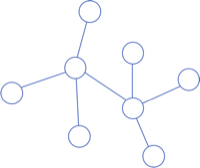
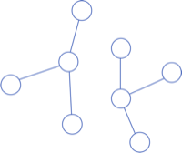
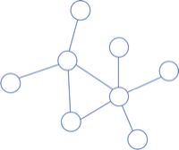
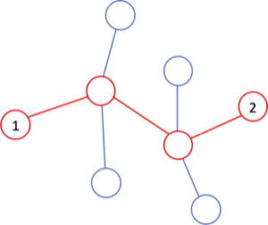
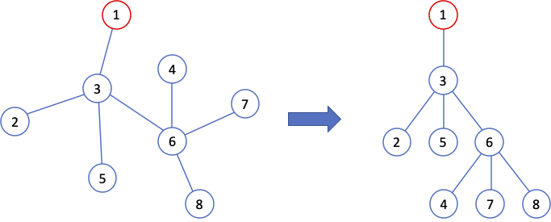
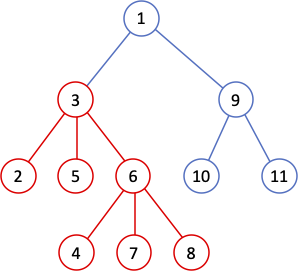

# 트리

## 트리의 정의
트리는 그래프의 일종으로, 보통 다음 세 조건을 **모두** 만족하는 것을 트리라고 한다.

1. 무방향 그래프이다.
1. 모든 정점들이 연결되어 있다. 즉, 어떠한 두 정점을 잡아도 한 정점에서 다른 정점까지 가는 경로가 존재한다.
1. 사이클(순환)이 존재하지 않는다.

다음은 올바른 트리이다.



다음은 올바른 트리가 아니다. 첫 번째 트리는 모든 정점들이 연결되어 있지 않고, 두 번째 트리는 사이클이 있기 때문이다.

| 연결되지 않은 그래프 | 사이클이 있는 그래프 |
| --- | --- |
|  |  |

## 트리의 성질
트리에서는, 노드의 개수를 V, 에지의 개수를 E라 했을 때 `V = E + 1`을 만족한다. 곰곰이 생각해보면 트리의 세 가지 조건을 모두 만족하려면 그럴 수밖에 없다는 것을 알 수 있을 것이다.

또, 갔던 노드를 두 번 이상 방문하지 않으면서 한 노드에서 다른 노드까지 가는 경로는 무조건 하나만 존재한다. 이것은 모든 정점들이 연결되어 있으면서 사이클이 없다는 트리의 특성 때문이다. 아래 그림에서 확인할 수 있듯이 노드 1에서 2로 가는 경로는 빨간 경로밖에 없다. 어떠한 두 노드를 잡아도 두 노드 간의 경로는 유일하게 존재한다는 것을 볼 수 있다.



## 루트가 있는 트리
위의 트리의 정의와는 별개로, 트리에 **루트**(root)라는 것을 만들면 트리를 분석하기 아주 편해진다. 이런 트리를 **루트가 있는 트리**(rooted tree)라고 부른다. 트리에 루트가 있으면 노드 사이에 계층적인 관계가 생긴다.

아래 그림에서, 왼쪽은 루트가 없는 트리이다. 왼쪽 트리에서 1번 노드를 붙잡고 트리 전체를 "끌어올리면", 오른쪽 그림처럼 나머지 노드들이 루트에서부터 뻗어나와 매달려 있는 모양이 될 것이다. 이때 1번 노드가 루트가 되는 것이다.



루트가 있는 트리에서의 몇 가지 중요한 용어에 대해 알아보자.

**루트 노드**: 위 그림의 1번 노드와 같이 트리의 가장 상위에 있는 노드이다.

**부모 노드**, **자식 노드**: 한 노드가 다른 노드와 직접 연결되어 있을 때, 위에 있는 노드를 부모 노드, 아래에 있는 노드를 자식 노드라고 한다. 예를 들어 위 그림에서 3번 노드는 5번 노드의 부모이다.

**조상**(ancestor) **노드**, **자손 노드**: 어떤 노드의 부모, 부모의 부모, ... 이렇게 트리를 거슬러 올라가며 만날 수 있는 노드들을 조상 노드라고 한다. 보통은 자기 자신도 자신의 조상 노드에 포함된다. 예를 들어 위 그림에서 4번 노드의 조상을 모두 나열하면 4, 6, 3, 1이다. 자손 노드는 당연히 조상 노드의 반대다.

**부트리**(subtree): 트리의 한 노드를 골라서, 그 노드의 자손들만 모두 모으면 그 노드를 루트로 하는 트리의 부분집합을 만들 수가 있는데, 이것을 부트리 혹은 서브트리(subtree)라고 한다. 예를 들어 다음 그림에서 빨간색 표시한 것이 3번 노드를 루트로 하는 부트리다.



**깊이**(depth, level): 어떤 노드가 얼마나 깊이 있는지를 트리의 깊이(depth) 또는 레벨(level)이라고 한다. 루트의 레벨을 0이라 놓으면, 루트의 자식들은 레벨이 1, 그 자식들은 2, ... 이 된다.

**높이**(height): 트리에 존재하는 레벨의 수, 즉 트리가 아래위로 얼마나 뻗어있는지를 나타낸다.

## 트리의 표현
루트가 없는 트리는 그래프와 똑같은 형식으로 저장한다. 하지만 그리 효율적인 방법은 아니다.

루트가 있는 트리에서는, 각 노드의 부모만 저장하고 있어도 트리 전체를 표현할 수 있다. 예를 들어 다음과 같은 배열이 있을 때, `parent[3]`가 1이라면, 3번 노드의 부모가 1번 노드라는 것을 의미하게 된다.

```c++
int parent[10001];
```

어떨 때는 각 노드 별로 부모만 저장해도 충분하지만, 어떨 때는 자식 노드들도 알아야 하기 때문에 다음과 같이 `Node` 구조체로 이루어진 배열을 만들어서 부모와 자식을 저장할 수 있다. 예를 들어 `nodes[3].child`는 3번 노드의 자식을 저장하는 벡터를 의미한다.

```c++
struct Node {
    int par;            // 부모
    vector<int> child;  // 자식(들)
};

Node nodes[10001];
```

루트의 부모는 보통 0 같은 숫자나, 자기 자신으로 설정한다.
