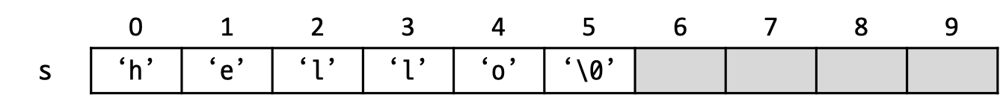

# 문자열

C에서 문자 한 글자를 저장할 때는 `char` 자료형을 쓴다는 것을 배웠다. 문자는 작은따옴표 사이에 넣어 표현한다.

```c++
char a = 'A';
```

하지만 `char`는 정확히 한 글자만 저장할 수 있기 때문에, "hello" 같은 문자열을 `char`형 변수에 저장할 수는 없다.

```c++
char a = 'hello';  // 에러! 작은따옴표 사이에는 문자 한 글자만 넣을 수 있다.
char b = "hello";  // 에러! 등호의 우변이 문자열이어서 좌변에 대입할 수 없다.
```

C에서 이렇게 여러 글자로 이루어진 단어나 문장 등을 저장할 때는 문자열을 사용해야 한다.

문자열이란, 여러 문자가 나열되어 있는 것을 말한다. 예를 들어, `"abc"`, `"hello"`, `"가나다"`, `"A"`, `""`(빈 문자열) 등은 모두 문자열이다. C에서 문자열은 `char`형의 배열로 표현된다. 하지만 `char` 자료형으로 이루어진 배열이라고 모두 문자열이라고 할 수 있는 것은 아니고, 반드시 문자열 끝에 문자열의 끝이라는 것을 알려주는 널(null) 문자라는 것이 있어야 한다. 이런 특성을 어려운 말로 널 종단(-縱斷, null-terminated)이라고도 한다.

## Null 문자

널 문자에 대해 자세히 알아보자. 널 문자는 아스키 값 0을 갖는 특별한 문자이다. 출력해도 화면에 표시되지는 않고, 위에서 말했듯 문자열의 끝을 표시하는 용도로 쓰이는 문자이다. 예를 들어 다음과 같이 쓰면,

```c++
char s[10] = "hello";
```

다음과 같은 배열이 만들어진다. 여기서 `s[5]`에 들어있는 `\0`이라는 문자에 주목하자. 이것이 바로 널 문자이다.

{: height="50pt"}

따라서 위에 쓴 코드는 다음과 똑같은 말이다.

```c++
char s[10] = {'h', 'e', 'l', 'l', 'o', '\0'};
```

널 문자가 있기 때문에, **길이가 n인 문자열을 저장하기 위해서는, 널 문자까지 해서 총 n+1칸이 필요하다.** 이 점을 절대 잊지 말자.

### 퀴즈

다음과 같이 선언한 문자열은 총 몇 칸일까?

```c++
char s[] = "hello";
```

## 문자열 입출력

문자열을 출력하는 방법은 단순하다. `printf`에서 `%s`를 사용하면 된다.
```c++
char s[] = "Hello, world!";
printf("%s", s);
```
문자열을 입력 받기 위해서는 우선 `scanf`를 사용할 수 있는데, 특이한 점은 문자열 이름 앞에 `&`를 붙이지 않는다는 점이다. 어떤 컴파일러에서는 `&`를 붙여도 에러가 나지 않지만, 붙이지 않는 것이 문법에 맞다.
```c++
char s[101];  // 총 100글자까지 입력받을 수 있는 문자열 (나머지 한 칸은 널 문자)
scanf("%s", s);
```
문자열을 입력 받는 또다른 함수로 `fgets`가 있다. `fgets`는 매개변수로 문자열의 이름(`s`), 문자열의 최대 길이(`102`), 그리고 입력 스트림(`stdin`)이라는 것을 받는다. 이 인수는 항상 `stdin`이라는 특별한 이름으로 고정되어 있으니 외우도록 하자.
```c++
char s[102];
fgets(s, 102, stdin);
```
`fgets`와 `scanf`의 차이는 무엇일까? 아래 두 코드를 각각 실행한 후, "hello, world"를 입력해보자. 무엇이 출력되는가?
```c++
char s[101];
scanf("%s", s);  // hello, world 입력
printf("%s", s);
```
```c++
char s[102];
fgets(s, 102, stdin);  // hello, world 입력
printf("%s", s);
```
`scanf`는 단어 단위로 입력 받는 함수이기 때문에, 입력한 문자열에 띄어쓰기가 포함되어 있으면 그 전까지만 입력이 받아진다. 반면 `fgets`는 무조건 한 줄 전체를 입력 받는 함수이기 때문에, 띄어쓰기가 포함된 문자열도 받을 수 있다.

또 한 가지의 중요한 차이점은 `fgets`는 **맨 끝의 줄바꿈 문자(`\n`)도 받아진다는 것**이다. 따라서 예를 들어 최대 100글자의 문자열이 들어온다면 줄바꿈 문자(`\n`)와 널 문자(`\0`)를 위한 공간이 필요하므로 **문자열을 102칸 이상 잡아야 한다.**

## string.h 함수

`string.h`라는 헤더 파일 안에는 문자열 사용을 편리하게 해주는 여러 가지 함수들이 있다. 그 중 많이 쓰는 두 가지만 알아보자.

### strlen

**문자열의 길이**(**str**ing **len**gth)를 알려주는 함수이다. 문자열의 길이는 배열의 길이가 아니고, 널 문자가 나오기 전까지의, 실제로 문자열이 저장된 부분의 길이를 말한다. 아래 코드에서, 문자열을 저장하는 배열의 길이는 101이지만, 입력된 문자열은 5글자이기 때문에, `strlen`을 하면 5가 나온다.
```c++
char s[101];
scanf("%s", s);     // hello 입력
int len = strlen(s);
printf("%d", len);  // 5 출력
```

**중요!!** 문자열을 `fgets`로 받으면 맨 끝에 줄바꿈 문자(`\n`)가 있어서, 이것까지 포함한 길이가 구해진다. 에를 들어 `abc`를 입력하면 문자열 안에는 `"abc"`가 아니라 `"abc\n"`이 들어가 있으므로 길이가 4이다. 따라서 **`fgets`를 통해 입력 받은 문자열은 `strlen`을 통해 구한 값에서 1을 빼주어야 문자열의 실제 길이가 된다.**
```c++
char s[102];
fgets(s, 102, stdin);  // hello 입력
int len = strlen(s) - 1;
printf("%d", len);     // 5 출력
```

### strcmp

두 문자열을 **사전순으로 비교**(**str**ing **c**o**mp**are)하는 함수이다.

흔히 다음과 같은 실수를 하곤 한다.
```c++
char s[101];
scanf("%s", s);
if (s == "hello") {  // 에러!!
    ...
}
```
하지만 이건 잘못된 비교이다. 문자열도 결국 배열인데, 두 배열이 같은지 비교할 때는 저렇게 하면 안 되니까! 배열을 비교할 때는 `for`문을 써서 일일이 각 칸이 같은지 비교해야 한다.

하지만 문자열을 비교할 때는 특별히 `strcmp`를 사용할 수 있다. `strcmp` 함수는 앞 문자열이 뒤 문자열과 같으면 **0**을, 앞 문자열이 뒤 문자열보다 사전순으로 빠르면 **음수**를, 사전순으로 느리면 **양수**를 리턴한다. 예제를 보자.
```c++
char s[101];
scanf("%s", s);
if (strcmp(s, "hello") == 0) {
    printf("입력한 문자열이 hello입니다!\n");
} else if (strcmp(s, "hello") < 0) {
    printf("입력한 문자열이 hello보다 사전순으로 빠릅니다!\n");
} else {
    printf("입력한 문자열이 hello보다 사전순으로 느립니다!\n");
}
```
